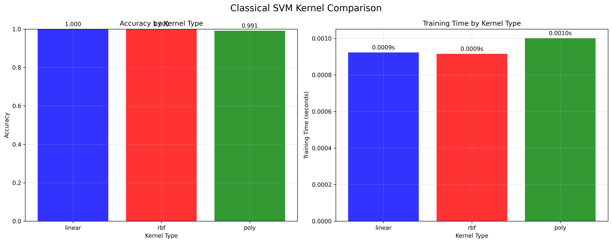
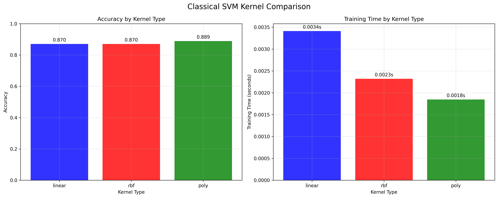

# Quantum SVM vs Classical SVM Comparison

Generated on: 2025-07-24 20:12:55

---

## Overview

This report compares the performance of Quantum Support Vector Machine (QSVM) and Classical Support Vector Machine (CSVM) on digit classification tasks. The comparison includes execution time, accuracy, and decision boundary analysis.

## Experiment: Digits 3 vs 4 (linear kernel)

### Performance Comparison

| Metric | QSVM | CSVM | Difference |
| --- | --- | --- | --- |
| Training Time (s) | inf | inf | nan |
| Accuracy (%) | 0.00 | 0.00 | 0.00 |

### Decision Boundary Visualization

*Decision boundaries for digits 3 vs 4*

### Analysis

QSVM was nanx faster to train than CSVM.

CSVM achieved 0.00% higher accuracy than QSVM.

## Experiment: Digits 3 vs 4 (rbf kernel)

### Performance Comparison

| Metric | QSVM | CSVM | Difference |
| --- | --- | --- | --- |
| Training Time (s) | inf | inf | nan |
| Accuracy (%) | 0.00 | 0.00 | 0.00 |

### Decision Boundary Visualization

*Decision boundaries for digits 3 vs 4*

### Analysis

QSVM was nanx faster to train than CSVM.

CSVM achieved 0.00% higher accuracy than QSVM.

## Experiment: Digits 1 vs 2 (linear kernel)

### Performance Comparison

| Metric | QSVM | CSVM | Difference |
| --- | --- | --- | --- |
| Training Time (s) | inf | inf | nan |
| Accuracy (%) | 0.00 | 0.00 | 0.00 |

### Decision Boundary Visualization

*Decision boundaries for digits 1 vs 2*

### Analysis

QSVM was nanx faster to train than CSVM.

CSVM achieved 0.00% higher accuracy than QSVM.

## Experiment: Digits 1 vs 2 (rbf kernel)

### Performance Comparison

| Metric | QSVM | CSVM | Difference |
| --- | --- | --- | --- |
| Training Time (s) | inf | inf | nan |
| Accuracy (%) | 0.00 | 0.00 | 0.00 |

### Decision Boundary Visualization

*Decision boundaries for digits 1 vs 2*

### Analysis

QSVM was nanx faster to train than CSVM.

CSVM achieved 0.00% higher accuracy than QSVM.

## Kernel Comparison Analysis

### Kernels for Digits 3 vs 4

| Kernel | Accuracy | Training Time (s) | F1-Score |
| --- | --- | --- | --- |
| Linear | 1.000 | 0.0009 | 1.000 |
| Rbf | 1.000 | 0.0009 | 1.000 |
| Poly | 0.991 | 0.0010 | 0.991 |

*Performance comparison across different kernel types*

### Kernels for Digits 1 vs 2

| Kernel | Accuracy | Training Time (s) | F1-Score |
| --- | --- | --- | --- |
| Linear | 0.870 | 0.0034 | 0.877 |
| Rbf | 0.870 | 0.0023 | 0.879 |
| Poly | 0.889 | 0.0018 | 0.898 |

*Performance comparison across different kernel types*

## Key Findings and Conclusions

- Total experiments conducted: 4
- No valid comparisons available
- No QSVM results
- No CSVM results
- No QSVM timing data
- No CSVM timing data
