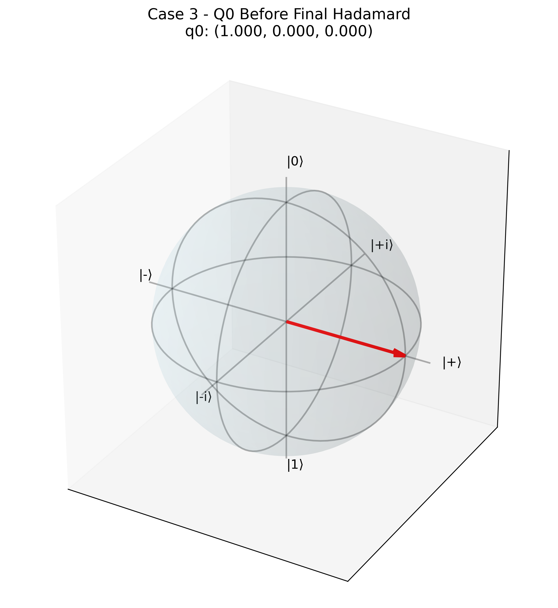

# Deutsch Algorithm Implementation Results

Generated on: 2025-07-26 07:43:15

---

## Overview

This report presents the implementation and analysis of the Deutsch algorithm across four different quantum circuit configurations. Each case demonstrates different oracle functions and their impact on quantum state evolution.

## Case 1: Identity Function

### Circuit Description

Oracle Type: No oracle gates (identity)

*Quantum circuit for Case 1*

### Quantum State Analysis

**States before final Hadamard gate:**

- q0: |0⟩

- q1: |1⟩

**States after final Hadamard gate:**

- q0: |0⟩

- q1: |-⟩ = (|0⟩ - |1⟩)/√2

### Bloch Sphere Visualizations

*Bloch sphere representation for qubit 0*

*Bloch sphere representation for qubit 1*

*Bloch sphere representation for qubit 2*

*Bloch sphere representation for qubit 3*

### Measurement Results

- Outcome '0': 1024/1024 (100.0%)

## Case 2: NOT Function

### Circuit Description

Oracle Type: CNOT gate

*Quantum circuit for Case 2*

### Quantum State Analysis

**States before final Hadamard gate:**

- q0: |0⟩

- q1: |1⟩

**States after final Hadamard gate:**

- q0: |1⟩

- q1: |-⟩ = (|0⟩ - |1⟩)/√2

### Bloch Sphere Visualizations

*Bloch sphere representation for qubit 0*

*Bloch sphere representation for qubit 1*

*Bloch sphere representation for qubit 2*

*Bloch sphere representation for qubit 3*

### Measurement Results

- Outcome '1': 1024/1024 (100.0%)

## Case 3: Constant 1 Function

### Circuit Description

Oracle Type: X-CNOT-X sequence

*Quantum circuit for Case 3*

### Quantum State Analysis

**States before final Hadamard gate:**

- q0: |0⟩

- q1: |1⟩

**States after final Hadamard gate:**

- q0: |1⟩

- q1: |-⟩ = (|0⟩ - |1⟩)/√2

### Bloch Sphere Visualizations

*Bloch sphere representation for qubit 0*

*Bloch sphere representation for qubit 1*

*Bloch sphere representation for qubit 2*

*Bloch sphere representation for qubit 3*

### Measurement Results

- Outcome '1': 1024/1024 (100.0%)

## Case 4: Complex Oracle Function

### Circuit Description

Oracle Type: CNOT-X-CNOT sequence

*Quantum circuit for Case 4*

### Quantum State Analysis

**States before final Hadamard gate:**

- q0: |0⟩

- q1: |1⟩

**States after final Hadamard gate:**

- q0: |0⟩

- q1: |-⟩ = (|0⟩ - |1⟩)/√2

### Bloch Sphere Visualizations

*Bloch sphere representation for qubit 0*

*Bloch sphere representation for qubit 1*

*Bloch sphere representation for qubit 2*

*Bloch sphere representation for qubit 3*

### Measurement Results

- Outcome '0': 1024/1024 (100.0%)

## Cross-Case Comparison

The following visualization compares measurement results across all circuit cases:

*Comparison of measurement probabilities and counts across all four cases*

## Theoretical Analysis

The Deutsch algorithm demonstrates quantum parallelism by determining whether a function is constant or balanced with just one quantum query, compared to two classical queries required in the worst case.

**Key Observations:**

- Cases 1 and 3 implement constant functions (f(x) = 0 and f(x) = 1 respectively)
- Case 2 implements a balanced function (f(x) = NOT x)
- Case 4 demonstrates a more complex oracle implementation
- The final measurement of q0 reveals the function type: 0 for constant, 1 for balanced
- Quantum superposition allows simultaneous evaluation of the function on all inputs
