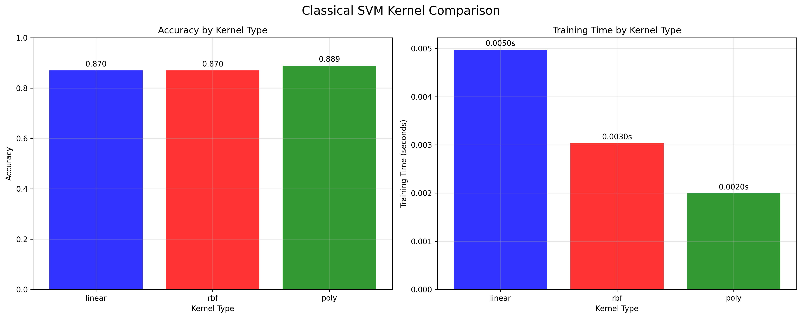

# Quantum SVM vs Classical SVM Comparison

Generated on: 2025-08-01 08:31:51

---

## Overview

This report compares the performance of Quantum Support Vector Machine (QSVM) and Classical Support Vector Machine (CSVM) on digit classification tasks. The comparison includes execution time, accuracy, and decision boundary analysis.

## Experiment: Digits 3 vs 4 (linear kernel)

### Performance Comparison

| Metric | QSVM | CSVM | Difference |
| --- | --- | --- | --- |
| Training Time (s) | 27.4618 | 0.0010 | 27.4608 |
| Accuracy (%) | 0.54 | 1.00 | -0.46 |

### Decision Boundary Visualization

*Decision boundaries for digits 3 vs 4*

### Analysis

QSVM took 27457.3x longer to train than CSVM.

CSVM achieved 0.46% higher accuracy than QSVM.

## Experiment: Digits 3 vs 4 (rbf kernel)

### Performance Comparison

| Metric | QSVM | CSVM | Difference |
| --- | --- | --- | --- |
| Training Time (s) | 35.3114 | 0.0020 | 35.3094 |
| Accuracy (%) | 0.54 | 1.00 | -0.46 |

### Decision Boundary Visualization

*Decision boundaries for digits 3 vs 4*

### Analysis

QSVM took 17728.9x longer to train than CSVM.

CSVM achieved 0.46% higher accuracy than QSVM.

## Experiment: Digits 1 vs 2 (linear kernel)

### Performance Comparison

| Metric | QSVM | CSVM | Difference |
| --- | --- | --- | --- |
| Training Time (s) | 33.6983 | 0.0041 | 33.6942 |
| Accuracy (%) | 0.51 | 0.87 | -0.36 |

### Decision Boundary Visualization

*Decision boundaries for digits 1 vs 2*

### Analysis

QSVM took 8243.9x longer to train than CSVM.

CSVM achieved 0.36% higher accuracy than QSVM.

## Experiment: Digits 1 vs 2 (rbf kernel)

### Performance Comparison

| Metric | QSVM | CSVM | Difference |
| --- | --- | --- | --- |
| Training Time (s) | 31.5922 | 0.0025 | 31.5896 |
| Accuracy (%) | 0.51 | 0.87 | -0.36 |

### Decision Boundary Visualization

*Decision boundaries for digits 1 vs 2*

### Analysis

QSVM took 12630.5x longer to train than CSVM.

CSVM achieved 0.36% higher accuracy than QSVM.

## Kernel Comparison Analysis

### Kernels for Digits 3 vs 4

| Kernel | Accuracy | Training Time (s) | F1-Score |
| --- | --- | --- | --- |
| Linear | 1.000 | 0.0011 | 1.000 |
| Rbf | 1.000 | 0.0020 | 1.000 |
| Poly | 0.991 | 0.0010 | 0.991 |

*Performance comparison across different kernel types*

### Kernels for Digits 1 vs 2

| Kernel | Accuracy | Training Time (s) | F1-Score |
| --- | --- | --- | --- |
| Linear | 0.870 | 0.0050 | 0.877 |
| Rbf | 0.870 | 0.0030 | 0.879 |
| Poly | 0.889 | 0.0020 | 0.898 |

*Performance comparison across different kernel types*

## Summary Analysis

**Overall Performance Summary:**

- Average QSVM training time: 32.0159s

- Average CSVM training time: 0.0024s

- Average QSVM accuracy: 0.52%

- Average CSVM accuracy: 0.94%

**Key Findings:**

- QSVM generally requires more training time than CSVM

- CSVM maintains competitive or superior accuracy performance

## Key Findings and Conclusions

- Total experiments conducted: 4
- QSVM accuracy wins: 0/4 experiments
- Average QSVM accuracy: 0.523
- Average CSVM accuracy: 0.935
- Average QSVM training time: 32.0159s
- Average CSVM training time: 0.0024s
